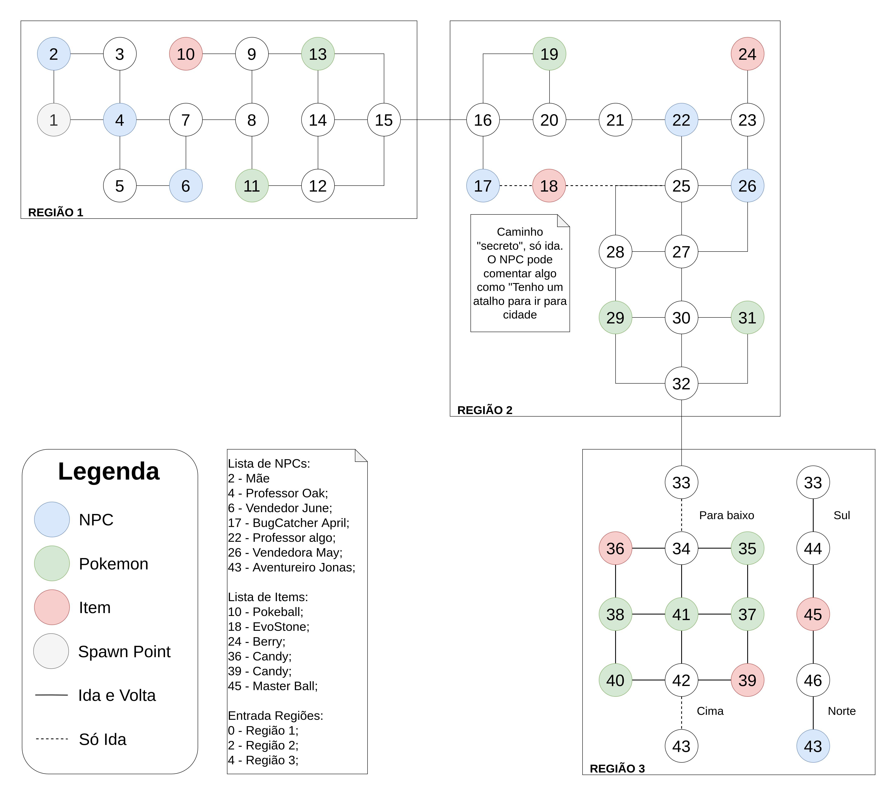
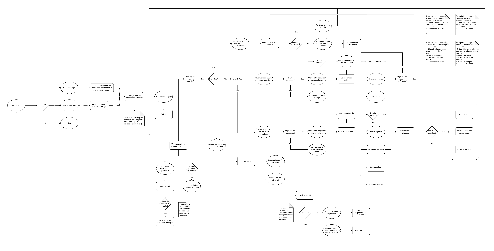

# Artefatos do Jogo

|    Data    | Versão | Descrição | Autor |
| :---: | :----: | :---: | :---: |
| 25/04/2022 | 1.0 | Criação do documento | [Iuri Severo](https://github.com/iurisevero) |

Durante o desenvolvimento do projeto, alguns artefatos foram criados para auxiliar o grupo em como ficaria a versão final do jogo. Os dois principais artefatos gerados foram o **Mapa** e o **Fluxograma de Atividades**. Esses artefatos foram gerados após diversas reuniões e brainstorms, porém não foram criados documentos formais dessas discussões.

## Mapa
O mapa foi desenvolvido durante a entrega do Módulo 4, [SQL](../SQL/SQL.md), e teve como objetivo facilitar a visualização de seu formato e como ele se organizaria. O mapa pode ser vista abaixo.

## Fluxograma de Atividades
O fluxograma foi desenvolvido após a entrega do Módulo 5, [Álgebra Relacional](../AlgebraRelacional/AlgebraRelacional.md), e teve como objetivo mapear as possíveis ações de um usuário que estivesse jogando o projeto desenvolvido.

O diagrama desenvolvido não seguiu nenhum padrão UML e, quando analisado por pessoas de fora do grupo, pode parecer um pouco confuso. No entanto, como era necessário que ele fosse criado rapidamente e para uso interno, essa falta de padronização não foi prejudicial.

Uma abstração para facilitar a interpretação do fluxograma é que as formas circulares são estados em que o usuário se encontra, as formas retangulares são funções acionadas pelo sistema, e os losângulos demarcam divisões por condicionais.

O fluxograma pode ser visto abaixo.

