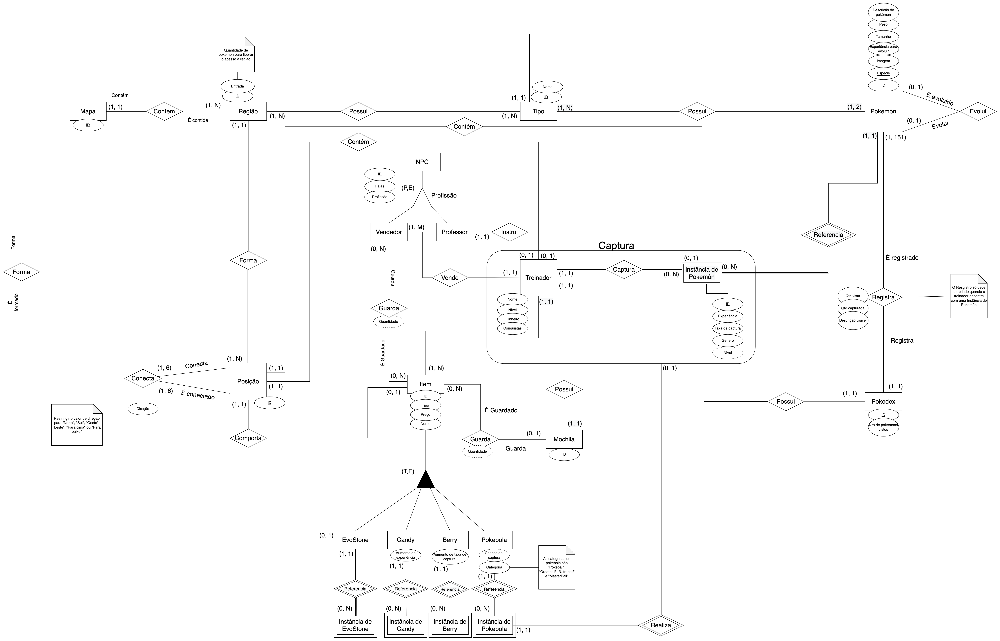
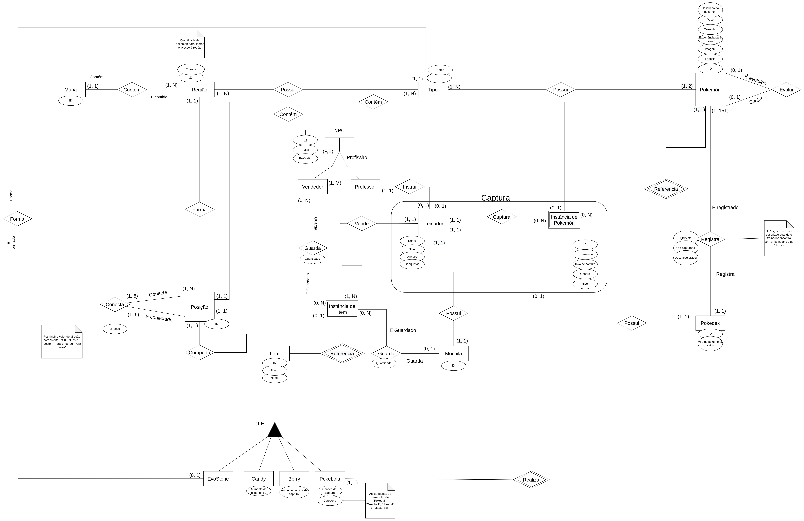
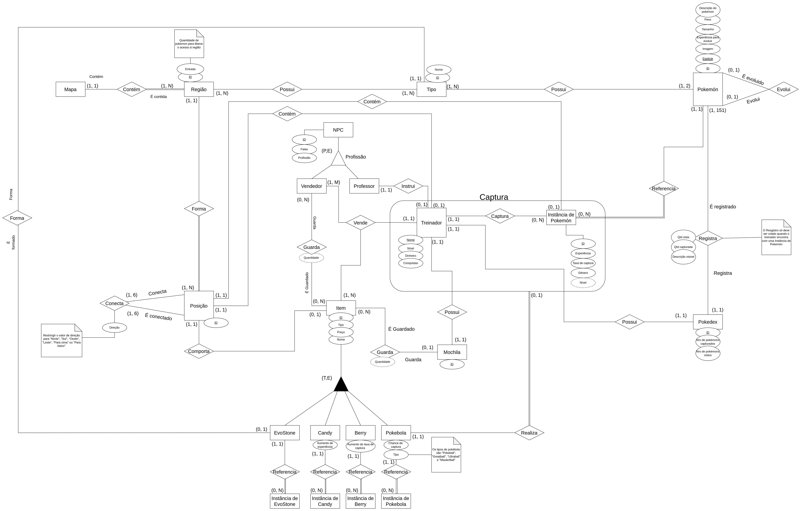
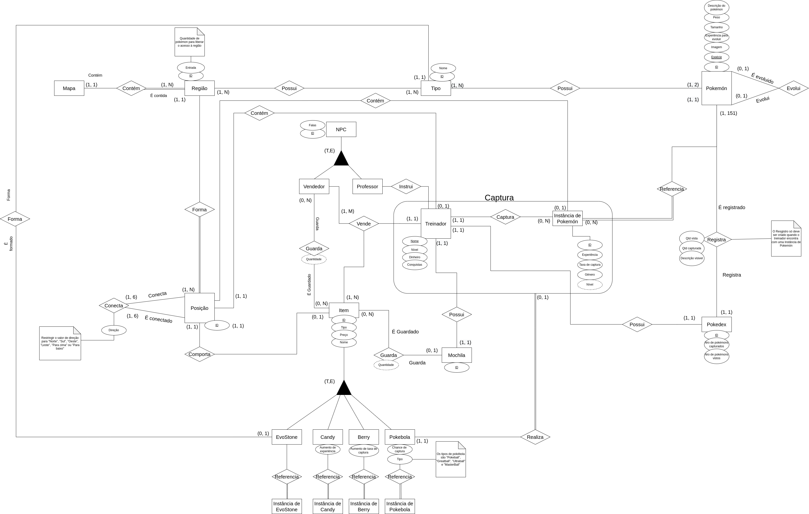
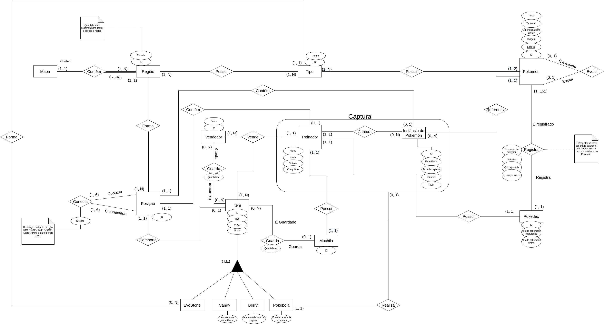
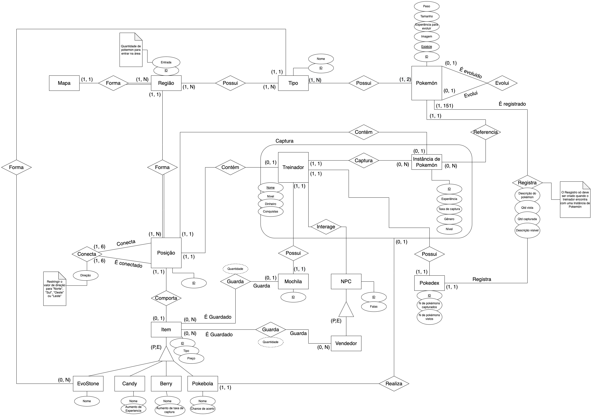
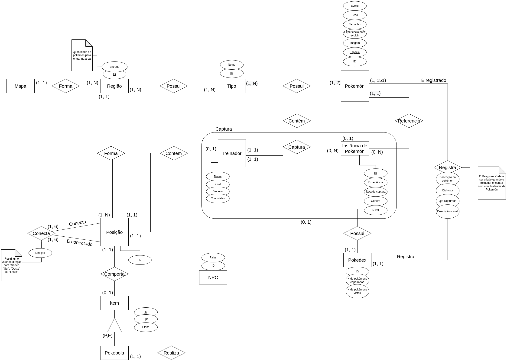
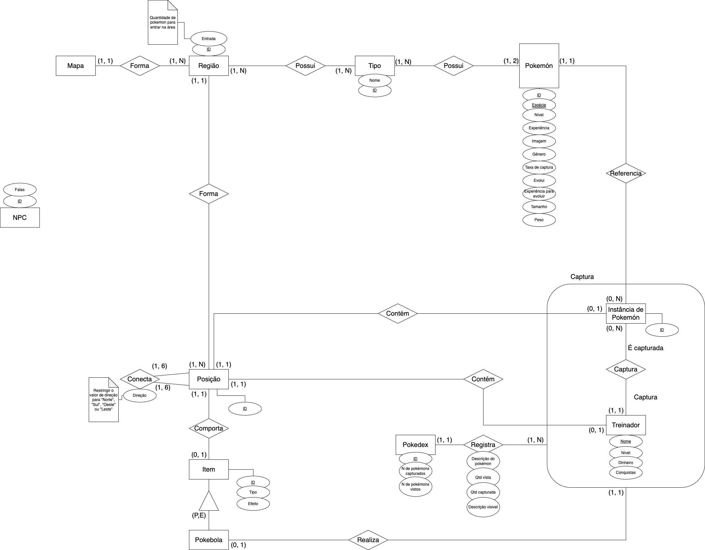
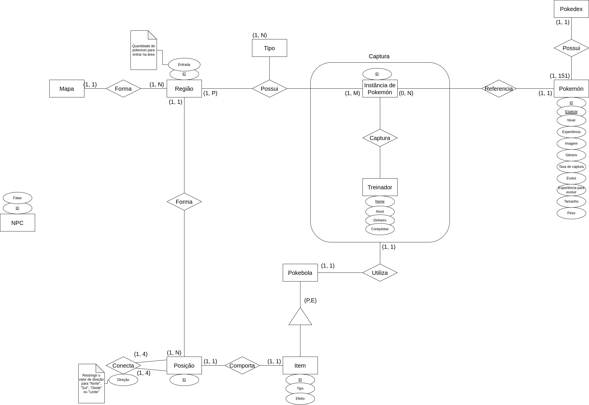
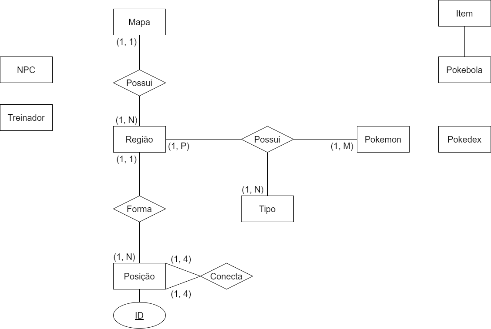

# Modelo Entidade-Relacionamento

|    Data    | Versão | Descrição | Autor |
| :---: | :----: | :---: | :---: |
| 31/01/2022 | 0.1 | Criação do documento | [Iuri Severo](https://github.com/iurisevero) |
| 31/01/2022 | 0.2 | Adição DER 0.3 | [Iuri Severo](https://github.com/iurisevero), [Arthur Matos](https://github.com/Arthur-Gaudium) |
| 31/01/2022 | 0.3 | Adição DER 0.4 | [Iuri Severo](https://github.com/iurisevero) |
| 31/01/2022 | 0.4 | Adição DER 0.5 | [Iuri Severo](https://github.com/iurisevero), [Arthur Matos](https://github.com/Arthur-Gaudium) |
| 04/02/2022 | 0.5 | Adição DER 0.6 | [Victor Buendia](https://github.com/Victor-Buendia) |
| 05/02/2022 | 0.6 | Adição do versionamento entre os DER's | [Lucas Medeiros](https://github.com/medeiroslucas) |
| 06/02/2022 | 1.0 | Adição da versão 1.0 do DER e "O que é" | [Iuri Severo](https://github.com/iurisevero), [Victor Buendia](https://github.com/Victor-Buendia) |
| 15/02/2022 | 1.1 | Adição da versão 1.1 do DER | [Arthur Matos](https://github.com/Arthur-Gaudium) |

## O que é?

O MER (Modelo Entidade Relacionamento) é utilizado para descrever os objetos do mundo real através de **entidades**, que possuem **atributos** e **relacionamentos** para descrever suas propriedades e, desssa forma, representar os aspectos estáticos do Domínio da Aplicação. 

O DER (Diagrama Entidade-Relacionamento) é utilizado para representar em forma gráfica o que foi descrito no MER (Modelo Entidade Relacionamento).

## Diagrama Entidade-Relacionamento

### Desenvolvimento do Diagrama Entidade-Relacionamento

Durante a criação do Diagrama Entidade-Relacionamento (DER) foram geradas diversas versões do diagrama antes que ele alcançasse sua versão atual. Todas versões geradas podem ser vistas abaixo, assim como quem contribuiu nas alterações feitas naquela versão.

Clique para apresentar a versão 1.1 do DER

### DER v1.2

As modificações realizadas nesta versão foram:
- Alteração nas especializações de items
- Exclusão das entidades fracas de se relacionavam com as especializações de item
- Criação da entidade fraca Instância de Item
- Redistribuição dos relacionamentos de Item para Instância de Item

**Autor(es):** [Arthur Matos](https://github.com/Arthur-Gaudium), [Iuri Severo](https://github.com/iurisevero), [João Pedro José](https://github.com/sudjoao), [Victor Buendia](https://github.com/Victor-Buendia)  

Clique para apresentar a versão 1.2 do DER

### DER v1.1

As modificações realizadas nesta versão foram:
- Alteração nas entidades que deveriam ser entidades fracas;
- Alteração do relacionamento de captura com pokebola para com instância de pokebola;
- Adição da chave primária do mapa;

**Autor(es):** [Arthur Matos](https://github.com/Arthur-Gaudium)

Clique para apresentar a versão 1.1 do DER

### DER v1.0

As modificações realizadas nesta versão foram:
- Correção da especificação de NPCs
- Adição da cardinalidade entre os itens e suas respectivas instâncias

**Autor(es):** [Iuri Severo](https://github.com/iurisevero), [Victor Buendia](https://github.com/Victor-Buendia)

Clique para apresentar a versão 1.0 do DER

### DER v0.7

As modificações realizadas nesta versão foram:
- Criação das entidades de instancia dos itens;
- Alteração do relacionamento para Participação Total em todas as instâncias;
- Criação da generalização NPC;
- Criação da entidade Professor;
- Criação do relacionamento Professor-Treinador;
- Alteração na cardinalidade da EvoStone - Tipo.

**Autor(es):** [João Guedes](https://github.com/sudjoao) e [Lucas Medeiros](https://github.com/medeiroslucas)

Clique para apresentar a versão 0.6 do DER

### DER v0.6
As modificações realizadas nesta versão foram:
- Eliminação do CE **NPC** e a herança incorreta que ela possuía;
- Inserção do ternário entre os CEs **Vendedor**, **Item** e **Treinador** através do CR **Vende**;
- Alteração das notas textuais incorretas de movimento para incluir movimentos "Para cima" e "Para baixo";
- Transformação do atributo "Nível" para derivado na **Instância de Pokémon**;
- Alteração da herança incorreta de (P,E) para (T,E) nos itens.

**Autor(es):** [Victor Buendia](https://github.com/Victor-Buendia)  

Clique para apresentar a versão 0.5 do DER

### DER v0.5

As principais modificações realizadas nesta versão foram:
- Criação da CE **Mochila**
- Criação da CE **Vendedor**
- Criação da CE **EvoStone**
- Criação da CE **Candy**
- Criação da CE **Berry**
- Adição de outras heranças para **Item**: **EvoStone**, **Candy**, **Berry**
- Adição de uma nova herança para **NPC**: **Vendedor**
- Novo relacionamento entre **Item** e **Mochila**
- Novo relacionamento entre **Item** e **Vendedor**
- Novo relacionamento entre **Treinador** e **NPC**
- Novo relacionamento entre **Treinador** e **Mochila**
- Novo relacionamento entre **EvoStore** e **Tipo**
- Novo auto-relacionamento *evolui* para **Pokemon** 

**Autor(es):** [Arthur Matos](https://github.com/Arthur-Gaudium), [Iuri Severo](https://github.com/iurisevero)  

Clique para apresentar a versão 0.4 do DER

### DER v0.4

As principais modificações realizadas nesta versão foram:
- Adição dos atributos de **Instância de Pokemon**
- Remoção do relacionamento entre **Pokedex** e **Instância de Pokemon**
- Novo relacionamento entre **Treinador** e **Pokedex**
- Novo relacionamento entre **Pokemon** e **Pokedex**

**Autor(es):** [Iuri Severo](https://github.com/iurisevero)  

Clique para apresentar a versão 0.3 do DER

### DER v0.3

As principais modificações realizadas nesta versão foram:
- Adição dos atributos de **Tipo**
- Adição dos atributos na relação *Registra* entre **Pokedex** e **Instância de Pokemon**
- Adição do relacionamento entre **Instância de Pokemon** e **Posição**
- Remoção do ternário entre **Região**, **Tipo** e **Instância de Pokemon** para dois relacionamentos
- Novo relacionamento entre **Região** e **Tipo**
- Novo relacionamento entre **Tipo** e **Pokemon**

**Autor(es):** [Arthur Matos](https://github.com/Arthur-Gaudium), [Iuri Severo](https://github.com/iurisevero)  

Clique para apresentar a versão 0.2 do DER

### DER v0.2

As principais modificações realizadas nesta versão foram:
- Criação da CE **Instância de Pokemon**
- Adição dos atributos de **Pokemon**
- Adição dos atributos de **Treinador**
- Adição dos atributos de **NPC**
- Adição dos atributos de **Item**
- Adição dos atributos de **Região**
- Adição do relacionamento entre **Pokedex** e **Pokemon**
- Adição do relacionamento entre **Instância de Pokemon** e **Treinador**
- Adição do relacionamento entre **Item** e **Posição**
- Adição do relacionamento entre **Treinador** e **Pokebola**

**Autor(es):** [Arthur Matos](https://github.com/Arthur-Gaudium), [Iuri Severo](https://github.com/iurisevero), [João Pedro José](https://github.com/sudjoao), [Victor Buendia](https://github.com/Victor-Buendia)  

Clique para apresentar a versão 0.1 do DER

### DER v0.1

**Autor(es):** [Arthur Matos](https://github.com/Arthur-Gaudium), [Iuri Severo](https://github.com/iurisevero), [João Pedro José](https://github.com/sudjoao), [Victor Buendia](https://github.com/Victor-Buendia)  

