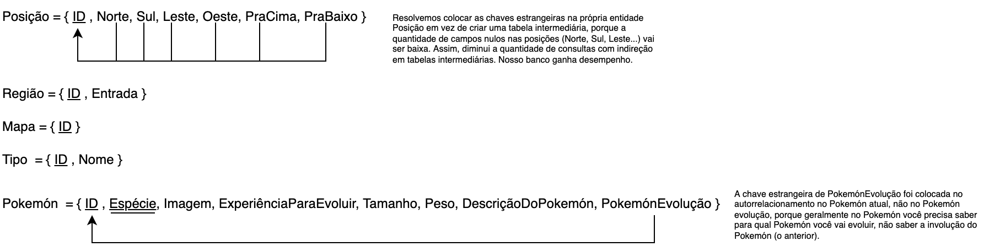

# Modelo Relacional

|    Data    | Versão | Descrição | Autor |
| :---: | :----: | :---: | :---: |
| 14/02/2022 | 0.1 | Adição MREL 0.1 | [Victor Buendia](https://github.com/Victor-Buendia) |

## O que é?

O MREL (Modelo Relacional) é utilizado para apoiar a implementação das aplicações, apresentando um projeto lógico de como as entidades e relacionamentos serão mapeadas no SGBD, porém é um modelo lógico não atrelado a algum SGBD específico.

## Mapeamento MER ➔ MREL

*imagem final v1.0*

### Desenvolvimento do Modelo Relacional

Durante a criação do Modelo Relacional (MREL) foram geradas diversas versões do modelo antes que ele alcançasse sua versão atual. Todas versões geradas podem ser vistas abaixo, assim como quem contribuiu nas alterações feitas naquela versão.

### DER v0.1

Clique para apresentar a versão 0.1 do MREL

**Autor(es):** [Victor Buendia](https://github.com/Victor-Buendia)  

