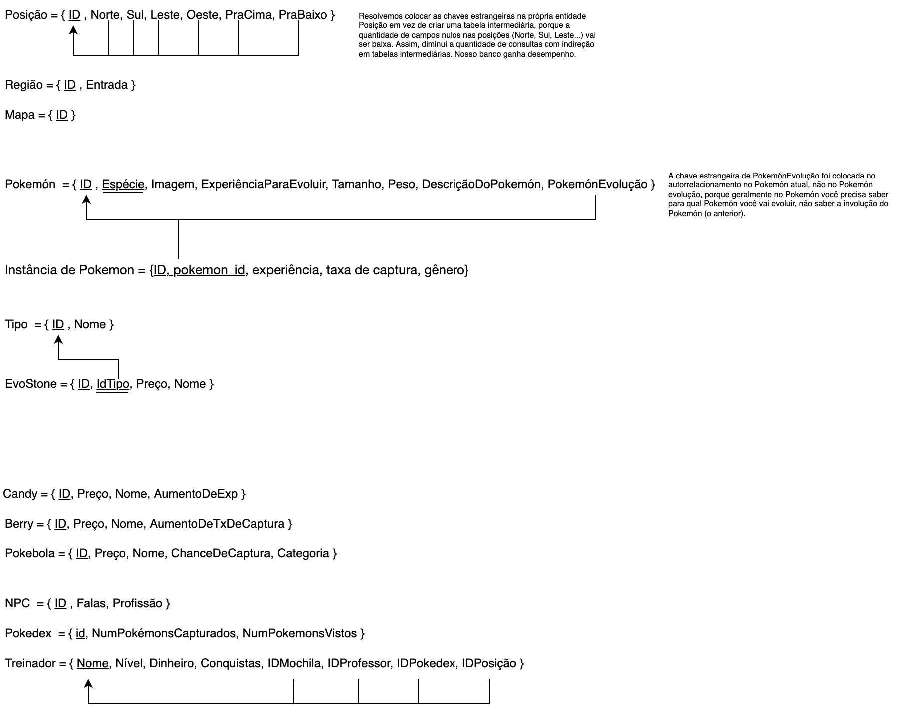

# Modelo Relacional

|    Data    | Versão | Descrição | Autor |
| :---: | :----: | :---: | :---: |
| 14/02/2022 | 0.1 | Adição MREL 0.1 | [Victor Buendia](https://github.com/Victor-Buendia) |
| 16/02/2022 | 0.2 | Adição MREL 0.2 | [Victor Buendia](https://github.com/Victor-Buendia), [João Pedro José](https://github.com/sudjoao) |
| 17/02/2022 | 0.3 | Adição MREL 0.3 | [Lucas Medeiros](https://github.com/medeiroslucas), [Iuri Severo](https://github.com/iurisevero) |
| 17/02/2022 | 0.4 | Adição MREL 0.4 | [Lucas Medeiros](https://github.com/medeiroslucas), [Iuri Severo](https://github.com/iurisevero), [Victor Buendia](https://github.com/Victor-Buendia), [João Pedro José](https://github.com/sudjoao) e [Arthur Matos](https://github.com/Arthur-Gaudium)  |
| 18/02/2022 | 0.5 | Adição MREL 0.5 | [Lucas Medeiros](https://github.com/medeiroslucas), [Iuri Severo](https://github.com/iurisevero), [Victor Buendia](https://github.com/Victor-Buendia), [João Pedro José](https://github.com/sudjoao) e [Arthur Matos](https://github.com/Arthur-Gaudium)  |
| 18/02/2022 | 0.6 | Adição MREL 0.6 | [Iuri Severo](https://github.com/iurisevero), [Lucas Medeiros](https://github.com/medeiroslucas), [Victor Buendia](https://github.com/Victor-Buendia), [João Pedro José](https://github.com/sudjoao) e [Arthur Matos](https://github.com/Arthur-Gaudium)  |
| 20/02/2022 | 0.7 | Adição MREL 0.7 | [Victor Buendia](https://github.com/Victor-Buendia), [Iuri Severo](https://github.com/iurisevero) |
| 20/02/2022 | 0.8 | Adição MREL 0.8 | [Iuri Severo](https://github.com/iurisevero), [Victor Buendia](https://github.com/Victor-Buendia) |
| 20/02/2022 | 1.0 | Adição MREL 1.0 | [Arthur Matos](https://github.com/Arthur-Gaudium) |
| 22/03/2022 | 1.1 | Indicação das versões normalizadas | [Iuri Severo](https://github.com/iurisevero) |

## O que é?

O MREL (Modelo Relacional) é utilizado para apoiar a implementação das aplicações, apresentando um projeto lógico de como as entidades e relacionamentos serão mapeadas no SGBD, porém é um modelo lógico não atrelado a algum SGBD específico.

## Mapeamento MER ➔ MREL

> Versões mais atuais do MREL podem ser vistos na [página de Normalização](/MRELNormalizado/MRELNormalizado.md)

### Desenvolvimento do Modelo Relacional

Durante a criação do Modelo Relacional (MREL) foram geradas diversas versões do modelo antes que ele alcançasse sua versão atual. Todas versões geradas podem ser vistas abaixo, assim como quem contribuiu nas alterações feitas naquela versão.

Clique para apresentar a versão 1.0 do MREL

As modificações realizadas nesta versão foram:
- *Apenas revisão de primeira versão final*

**Autor(es):** [Arthur Matos](https://github.com/Arthur-Gaudium)  

Clique para apresentar a versão 0.8 do MREL

As modificações realizadas nesta versão foram:
- Remoção da tabela TreinadorCapturaInstanciaDePokemon, que estava duplicada
- Organização do diagrama, reduzindo o número de linha sobrepostas

**Autor(es):** [Iuri Severo](https://github.com/iurisevero), [Victor Buendia](https://github.com/Victor-Buendia)  

Clique para apresentar a versão 0.7 do MREL

As modificações realizadas nesta versão foram:
- Criação da tabela da agregação "Captura"
- Criação da tabela "Vende" para conectar o ternário Treinador, Instância e Vendedor
- Criação do mapeamento de chaves estrangeiras em vermelho
- Na instância de pokemón, retiramos id_pokemon como chave primária

**Autor(es):** [Victor Buendia](https://github.com/Victor-Buendia), [Iuri Severo](https://github.com/iurisevero)  

Clique para apresentar a versão 0.6 do MREL

As modificações realizadas nesta versão foram:
- Adição da generalização NPC
- Mapeamento das alguns relacionamentos N:M :
    - Vendedor \<guarda> Instancia de Item;
    - Professor \<instrui> Treinador;

**Autor(es):** [Iuri Severo](https://github.com/iurisevero), [João Pedro José](https://github.com/sudjoao)   

Clique para apresentar a versão 0.5 do MREL

As modificações realizadas nesta versão foram:
- Mapeamento das alguns relacionamentos 1:N :
    - Pokémon \<referencia> Instancia Pokémon;
    - Treinador \<captura> Instancia Pokémon;
    - Pokedex \<registra> Pokémon;
    - Mochila \<guarda> Instancia Item;
    - Posição \<forma> Região.
    - Mapa \<contem> Região.
    - Região \<possui> Tipo.
    
Nesta etapa iniciamos o passo 4 de mapear relacionamentos 1:N.

**Autor(es):** Todos os membros   

Clique para apresentar a versão 0.4 do MREL

As modificações realizadas nesta versão foram:
- Mapeamento das alguns relacionamentos 1:1 :
    - Posição \<contem> Instancia Pokémon;
    - Posição \<comporta> Instancia Item;
    - Treinador \<possui> Pokedex;
    - Tipo \<forma> Evostone;
    - Posição \<contém> Treinador.
    - Pokémon \<evolui> Pokémon.
    
Nesta etapa iniciamos o passo 3 de mapear relacionamentos 1:1.

**Autor(es):** Todos os membros   

Clique para apresentar a versão 0.3 do MREL

As modificações realizadas nesta versão foram:
- Mapeamento das entidades fracas:
    - Instância de Candy
    - Instância de Berry
    - Instância de Pokebola
    
Nesta etapa continuamos o passo 2 de mapear entidades fracas.

**Autor(es):** [Lucas Medeiros](https://github.com/medeiroslucas), [Iuri Severo](https://github.com/iurisevero)   

Clique para apresentar a versão 0.2 do MREL

As modificações realizadas nesta versão foram:
- Mapeamento das entidades:
    - Instância de Pokemón
    - EvoStone
    - Candy
    - Berry
    - Pokebola
    - NPC
    - Pokedex
    - Treinador
    
Nesta etapa finalizamos o passo 1 de mapear todas as entidades e começamos a etapa 2 de mapear entidades fracas *(Instância de Pokemón)*.

**Autor(es):** [Victor Buendia](https://github.com/Victor-Buendia), [João Pedro José](https://github.com/sudjoao)  

Clique para apresentar a versão 0.1 do MREL

**Autor(es):** [Victor Buendia](https://github.com/Victor-Buendia)  

