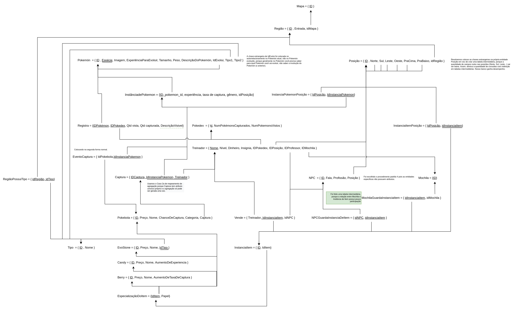
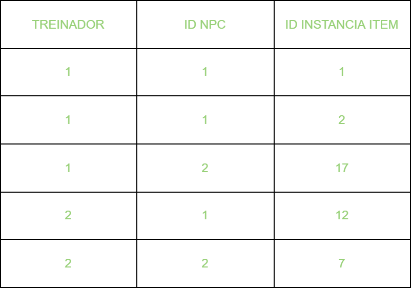
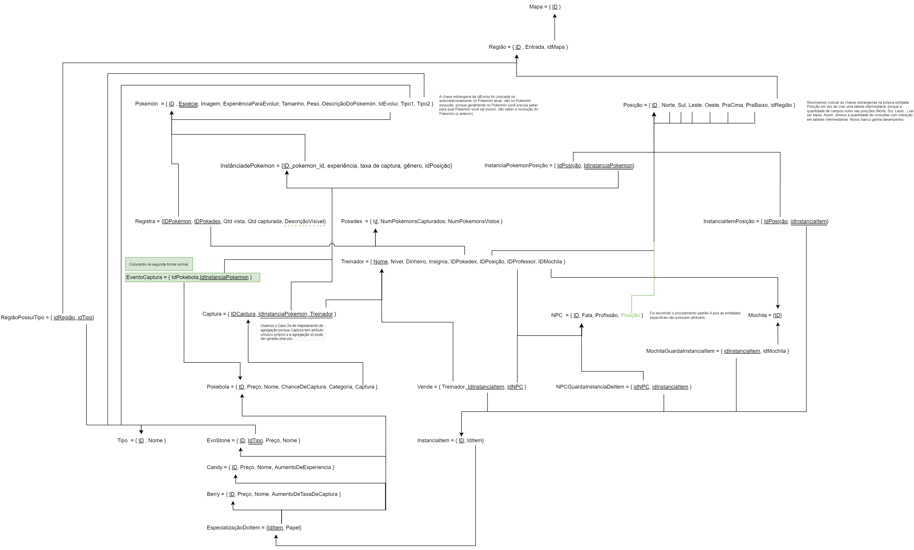

# Modelo Relacional Normalizado

|    Data    | Versão | Descrição | Autor |
| :---: | :----: | :---: | :---: |
| 28/02/2022 | 0.1 | Adição MREL 0.1 | [Iuri Severo](https://github.com/iurisevero), [Victor Buendia](https://github.com/Victor-Buendia), [João Pedro José](https://github.com/sudjoao) e [Arthur Matos](https://github.com/Arthur-Gaudium) |
| 04/03/2022 | 1.0 | Adição MREL 1.0 | [Iuri Severo](https://github.com/iurisevero), [Victor Buendia](https://github.com/Victor-Buendia), [João Pedro José](https://github.com/sudjoao) e [Arthur Matos](https://github.com/Arthur-Gaudium), [Lucas Medeiros](https://github.com/medeiroslucas) |

## O que é?

A normalização é o processo de organização de dados em um banco de dados. Onde, de acordo com regras pré estabelicidas, reformulamos algumas partes do Modelo Relaiconal para padronizá-lo.

## MREL Normalizado v1.0

Além disso, foi realizada uma análise, imagem abaixo, para saber se era preciso aplicar a 4 forma nominal no ternário Venda, realizado por treinador, npc e instancia de item e foi constatado que não fazia sentido.

### Desenvolvimento do Modelo Relacional Normalizado

Durante a normalização do Modelo Relacional (MREL) foram geradas diversas versões do modelo antes que ele alcançasse sua versão atual. Todas versões geradas podem ser vistas abaixo, assim como quem contribuiu nas alterações feitas naquela versão.

Clique para apresentar a versão 1.0 do MREL Normalizado

As modificações realizadas nesta versão foram:
- Reorganização dos atributos de EvoStone
- Adição da explicação da tabela MochilaGuardaInstanciaItem

**Autor(es):** Todos   

Clique para apresentar a versão 0.1 do MREL Normalizado

As modificações realizadas nesta versão foram:
- Criação de nova tabela (EvoCaptura) seguindo a Segunda Forma normal;
- Adição do atributo posição no NPC;
- Referência a chave secundária captura na pokebola.

**Autor(es):** Todos   

