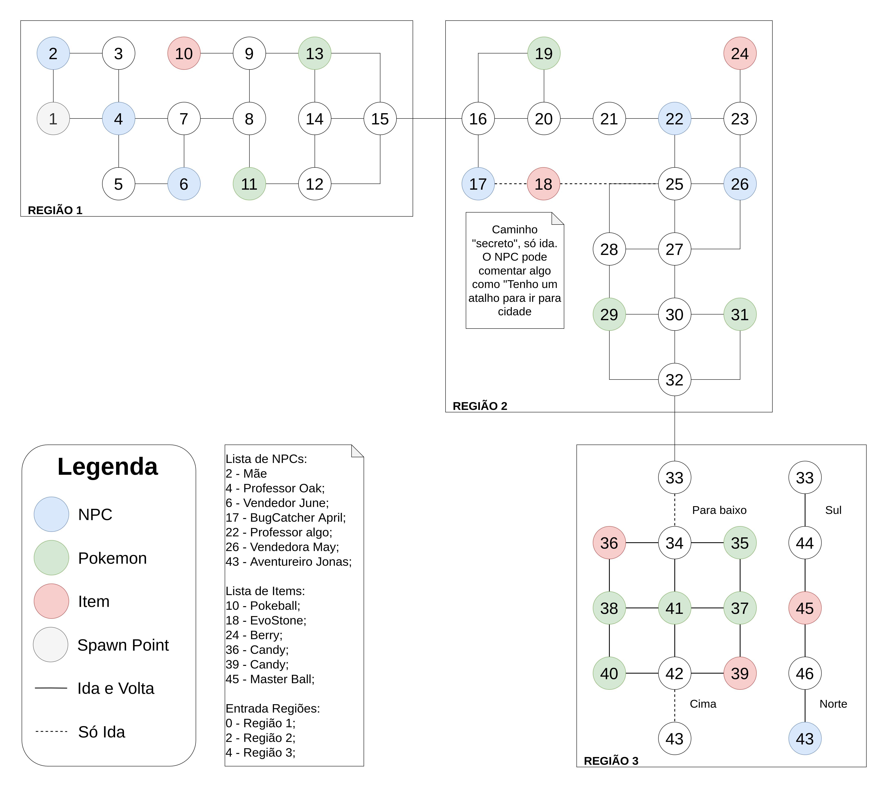

# SQL

|    Data    | Versão | Descrição | Autor |
| :---: | :----: | :---: | :---: |
| 16/03/2022 | 0.1 | Criação do SQL para todas tabelas sem chave estrangeiras  | [Iuri Severo](https://github.com/iurisevero), [Victor Buendia](https://github.com/Victor-Buendia), [João Pedro José](https://github.com/sudjoao) e [Lucas Medeiros](https://github.com/medeiroslucas)|
| 28/03/2022 | 1.0 | Adição dos dados sobre SQL | [Iuri Severo](https://github.com/iurisevero) |

## O que é?
Structured Query Language, ou Linguagem de Consulta Estruturada ou SQL, é a linguagem de pesquisa declarativa padrão para banco de dados relacional (base de dados relacional). [(SQL, Wikipedia, 2022)](https://pt.wikipedia.org/wiki/SQL)

Para o desenvolvimento do módulo referente a SQL foram criados dois arquivos:
- [DDL-DB.sql](https://raw.githubusercontent.com/SBD1/grupo1-pokemon/main/docs/SQL/DDL-BD.sql)
- [DML-DB.sql](https://raw.githubusercontent.com/SBD1/grupo1-pokemon/main/docs/SQL/DML-BD.sql)

O primeiro arquivo, _DDL-DB_, é voltado para os comandos de _Data Definition Language_, onde são definidos os esquemas da base de dados. De modo resumido, a criação das tabelas.

O segundo arquivo, _DMB-DB_, é voltado para os comandos de _Data Manipulation Language_, voltado para as instâncias da base de dados. Ele é responsável pelas inserções, remoções, alterações e consultas no banco.

## Data Definition Language (DDL)
Para criação do _DDL_ o grupo se reuniu e criou as tabelas das seguintes entidades, tirando a evostone, todas elas não possuem chave secundária:
- Mapa;
- Elemento;
- Mochila;
- Pokedex;
- Candy;
- Berry;
- Evostone.

As outras tabelas foram criadas no decorrer dos dias.

Além disso, o grupo criou três domínios chamados *moeda*, que contém as regras e formatação do moeda do jogo; *taxa_captura*, que contém as regras e formatação da taxa de captura dos pokemóns e itens do jogo, em porcentagem; e *nome*, que contém as regras para os nomes dos usuários, npcs e items.

## Data Manipulation Language (DML)
Para criação do _DML_ foram criados 7 grupos:
* Grupo 1: Elemento, Mapa, Região, Posição, Regiao possui Elemento
* Grupo 2: NPC, Treinador, Mochila, Pokedex
* Grupo 3: Especializacao do Item, Candy, Berry, Pokebola, Evostone, Instancia Item
* Grupo 4: Pokemon, Instancia Pokemon
* Grupo 5: Npc Guarda Instancia de Item, Mochila Guarda Instancia de Item
  * Dependência: Grupo 2 e do Grupo 3
* Grupo 6: Instancia Item Posicao, Instancia Pokemon Posicao
  * Dependência: Grupo 1, do Grupo 3 e do Grupo 4
* Grupo 7: Registra, Vende, Captura, Evento Captura
  * Dependência:
    * Registra depende do Grupo 2 e do Grupo 4
    * Vende depende do Grupo 2 e do Grupo 3
    * Captura depende do Grupo 2 e do Grupo 4
    * Evento Captura depende do Grupo 3 e do Grupo 4

Os 4 primeiros grupos possuem pouco dependência entre si, o que permitiu com que o grupo trabalhasse em paralelo para criá-los, enquanto os 3 últimos foram feitos em pareamentos realizados pelos membros que já haviam terminado as tarefas iniciais.

### Mapa
Para o desenvolvimento do mapa, foi criado um rascunho para que fosse possível visualizar seu formato e como ele se organizaria. Os racunho pode ser visto abaixo.

## Referências
- SQL, Wikipedia, https://pt.wikipedia.org/wiki/SQL, acessado em Março de 2022